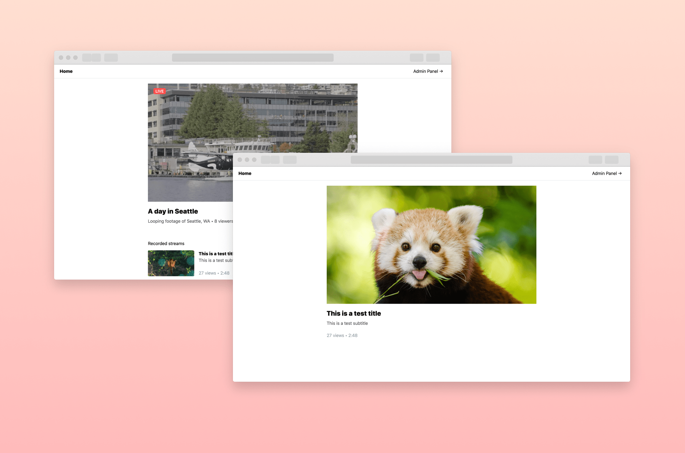

# Amazon IVS Auto-record to Amazon S3 Web Demo

This demo web application is an educational tool to show how to use the **Auto-record to S3** feature of Amazon IVS to automatically record livestreams, and make them available for on-demand viewing.

**This project is intended for education purposes only and not for production usage.**

This is a serverless web application, leveraging [Amazon IVS](https://aws.amazon.com/ivs/), [AWS Lambda](https://aws.amazon.com/lambda/), [API Gateway](https://aws.amazon.com/api-gateway/), [DynamoDB](https://aws.amazon.com/dynamodb/), [Amazon S3](https://aws.amazon.com/s3/), and [Amazon CloudFront](https://aws.amazon.com/cloudfront/).

## Getting Started

**\*IMPORTANT NOTE:** Deploying this demo application in your AWS account will create and consume AWS resources, which will cost money.\*

To successfully complete the installation, you will need the following information and resources:

**AWS Account and Access**

If you don't have an AWS account yet, [here's the process for creating one](https://aws.amazon.com/premiumsupport/knowledge-center/create-and-activate-aws-account/ "here's the process for creating one").

AWS uses the Identity and Access Management service to give roles and privileges to users. For your reference, [here's AWS guidance on using the IAM service](https://aws.amazon.com/iam/ "Here's AWS guidance on using the IAM service").

The IAM user used to install the IVS R2S3 software will need sufficient permissions to create and manage the following:

* IAM Roles
* DynamoDB Tables
* Lambda Functions
* API Gateways
* IVS Channels
* S3 Buckets
* CloudFormation Stacks

**Other Information and Resources**
You'll be setting up a number of different things during this process. Here's a short list of the information and resources you'll need to have ready to complete the installation.

* User names for privileged AWS access.
* A secure place on your computer you can store the confidential AWS user access credentials (IAM access keys).
* Names for AWS CLI profiles (usually based on user roles or user identities)
* A DNS-compliant name for the installation's S3 bucket. The bucket name must be:
  * All lowercase letters or numbers, with dashes allowed (but no other special characters).
  * Between 3 and 63 characters long.
  * Unique across all of Amazon S3 (you may need a couple of tries to create a unique one).
* A decision as to the AWS Region to be used for the installation.
* A name for the AWS stack which will be used for the IVS R2S3 infrastructure.

During the installation, you will also generate some unique information which will be used later. To perform these steps, you can use a text editor (such as Notepad) for recording this information and for modifying the example commands provided in the instructions.

## Installation Instructions

This demo must be installed in an AWS account using the Serverless installation files. Please view the **[README.md](./serverless/README.md)** file in the **serverless folder** for detailed installation instructions. This file provides guidance for using the AWS service consoles, the CloudShell console or the AWS CLI application for installing the software.

After the serverless installation is complete, follow the instructions in the **[README.md](./web-ui/README.md)** file in the **web-ui folder** to configure the client application.

## Amazon IVS Documentation
* [Amazon IVS Amazon Interactive Video Service](https://aws.amazon.com/ivs/) is a managed live streaming solution that is quick and easy to set up, and ideal for creating interactive video experiences. Simply send your live streams to Amazon IVS and the service does everything you need to make ultra-low latency live video available to any viewer around the world, letting you focus on building interactive experiences alongside the live video. [Learn more](https://aws.amazon.com/ivs/).
* [Amazon IVS docs](https://docs.aws.amazon.com/ivs/)
* [User Guide](https://docs.aws.amazon.com/ivs/latest/userguide/)
* [API Reference](https://docs.aws.amazon.com/ivs/latest/APIReference/)
* [Learn more about Amazon IVS on IVS.rocks](https://ivs.rocks/)
* [View more demos like this](https://ivs.rocks/examples)

## Known Issues
* The Amazon IVS channel used in this demo must be named `IVS-Channel`.
* Because of the distributed nature of Amazon CloudFront, you may get 403 or 404 errors if you try to use this application before CloudFront has completed its propagation to all EDGE locations. This may take up to a few hours.
* The application was written for demonstration purposes and not for production use.
* Currently only tested in the us-west-2 (Oregon) region. Additional regions may be supported depending on service availability.
* Thumbnail selection in the admin panel is not working as expected.

## License
This sample code is made available under a modified MIT license. See the LICENSE file.
